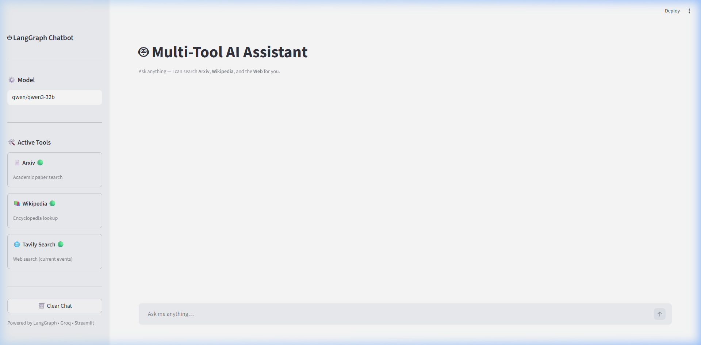
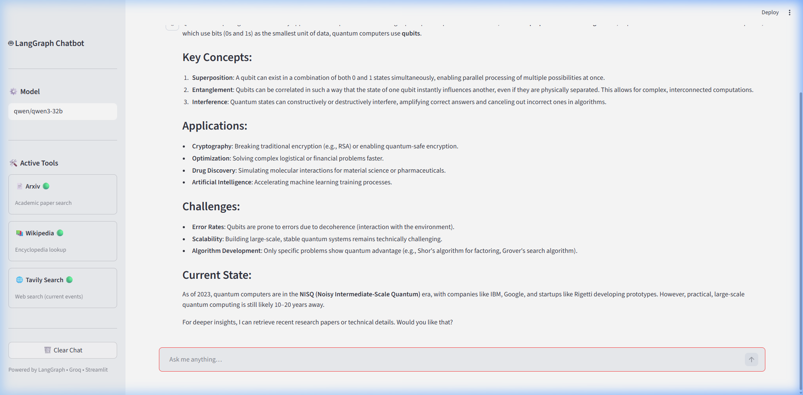
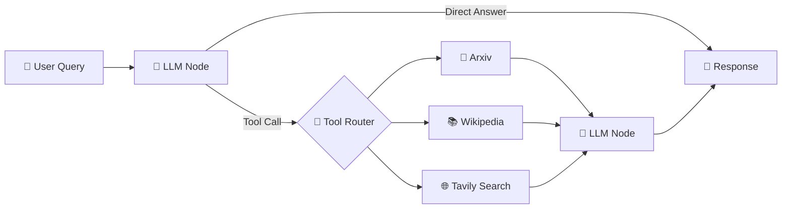

<div align="center">

# 🤖 LangGraph Multi-Tool Chatbot

### An intelligent AI assistant that autonomously searches **Arxiv**, **Wikipedia**, and the **Web** to answer your questions — powered by LangGraph's state-machine architecture.

[](https://python.org)
[](https://streamlit.io)
[](https://langchain-ai.github.io/langgraph/)
[](https://groq.com)
[](LICENSE)

<br/>



<br/>

</div>

---

## ✨ Features

| Feature | Description |
|---------|-------------|
| 🧠 **Multi-Tool Agent** | Automatically selects the right tool (Arxiv / Wikipedia / Tavily) based on your query |
| 🔀 **LangGraph State Machine** | Clean graph-based routing between LLM and tool nodes with conditional edges |
| 💬 **Streamlit Chat UI** | Elegant chat interface with tool-call indicators and expandable tool results |
| ⚙️ **Configurable Model** | Switch between any Groq-supported LLM model from the sidebar |
| 📜 **Chat History** | Full conversation context maintained across turns |
| 🔧 **Extensible** | Easily add new tools by defining them in `tools.py` |

---

## 📸 Screenshots

<div align="center">

| Main Interface | Chat in Action |
|:-:|:-:|
|  |  |
| *Clean sidebar with model config & active tools* | *AI-powered response with structured formatting* |

</div>

---

## 🏗️ Architecture

The chatbot uses a **LangGraph state graph** to route between the LLM and tool nodes. The LLM decides whether to answer directly or call an external tool, and the graph handles the routing automatically.



---

## 🛠️ Tools

| Tool | Source | Use Case |
|------|--------|----------|
| 📄 **Arxiv** | [arxiv.org](https://arxiv.org) | Academic papers, research publications, scientific content |
| 📚 **Wikipedia** | [wikipedia.org](https://wikipedia.org) | General knowledge, historical facts, encyclopedic info |
| 🌐 **Tavily** | [tavily.com](https://tavily.com) | Current events, recent news, real-time web search |

---

## 🚀 Quick Start

### Prerequisites

- Python 3.11+
- [Groq API Key](https://console.groq.com/) (free tier available)
- [Tavily API Key](https://tavily.com/) (free tier available)

### 1. Clone the Repository

```bash
git clone https://github.com/MdTalha17/LangGraph-Multitool-Chatbot.git
cd LangGraph-Multitool-Chatbot
```

### 2. Install Dependencies

```bash
pip install -r requirements.txt
```

### 3. Configure Environment Variables

Create a `.env` file in the project root:

```env
GROQ_API_KEY=your_groq_api_key_here
TAVILY_API_KEY=your_tavily_api_key_here
```

### 4. Run the App

```bash
streamlit run app.py
```

Open **http://localhost:8501** in your browser — and start chatting! 🎉

---

## 📁 Project Structure

```
LangGraph-Multitool-Chatbot/
│
├── app.py               # 🖥️  Streamlit chat UI (entry point)
├── graph.py             # 🔀  LangGraph state graph builder
├── tools.py             # 🔧  Tool definitions (Arxiv, Wikipedia, Tavily)
├── requirements.txt     # 📦  Python dependencies
├── .env                 # 🔐  Environment variables (not tracked)
├── LICENSE              # 📄  MIT License
├── assets/              # 🖼️  Screenshots & media
│   ├── main_interface.png
│   └── chat_response.png
└── README.md            # 📖  You are here!
```

---

## ⚙️ Configuration

### Switching Models

You can switch the Groq model directly from the **sidebar** in the UI. Simply type any [Groq-supported model ID](https://console.groq.com/docs/models) into the model input field. The default model is `qwen/qwen3-32b`.

### Adding New Tools

To add a new tool, update `tools.py`:

1. Import or define your tool
2. Add it to the list returned by `get_tools()`
3. Add metadata to `TOOL_INFO` for sidebar display

The LangGraph agent will automatically discover and route to the new tool.

---

## 🧰 Tech Stack

<div align="center">

| Technology | Role |
|:----------:|:----:|
| [LangGraph](https://langchain-ai.github.io/langgraph/) | Agent orchestration & state management |
| [Groq](https://groq.com) | Ultra-fast LLM inference |
| [LangChain](https://www.langchain.com/) | Tool wrappers & message handling |
| [Streamlit](https://streamlit.io) | Interactive web UI |
| [Tavily](https://tavily.com) | Real-time web search API |

</div>

---

## 🤝 Contributing

Contributions are welcome! Feel free to:

1. Fork the repository
2. Create a feature branch (`git checkout -b feature/amazing-feature`)
3. Commit your changes (`git commit -m 'Add amazing feature'`)
4. Push to the branch (`git push origin feature/amazing-feature`)
5. Open a Pull Request

---

## 📝 License

This project is licensed under the **MIT License** — see the [LICENSE](LICENSE) file for details.

---

<div align="center">

**Built with ❤️ using LangGraph • Groq • Streamlit**

⭐ Star this repo if you found it useful!

</div>
